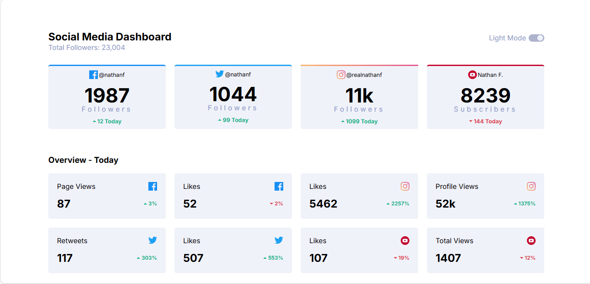
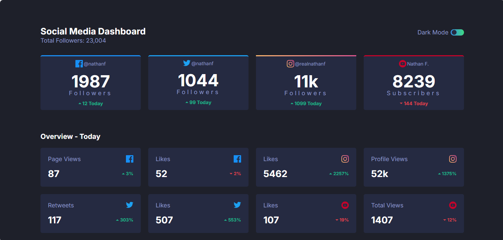

# Frontend Mentor - Social media dashboard with theme switcher

This is a solution to the [Social media dashboard with theme switcher
](https://www.frontendmentor.io/challenges/social-media-dashboard-with-theme-switcher-6oY8ozp_H). Frontend Mentor challenges help you improve your coding skills by building realistic projects.

## Table of contents

- [Overview](#overview)
  - [The challenge](#the-challenge)
  - [Screenshot](#screenshot)
  - [Links](#links)
  - [Installation](#Installation)
  - [Usage](#Usage)
- [My process](#my-process)
  - [Built with](#built-with)
  - [What I learned](#what-i-learned)
  - [Continued development](#continued-development)
- [Author](#author)
- [Acknowledgments](#Acknowledgments)

## Overview

### The challenge

This challenge will be a perfect chance to practice your Grid skills. The color theme switcher also adds a nice additional test.

Your users should be able to:

- Toggle color theme to their preference
- View the optimal layout for the interface depending on their device's screen size
- See hover and focus states for all interactive elements on the page

### Screenshot




### Links

- Solution URL: [here](https://github.com/olahasan/HTML_CSS_AND_J.S_Frontend-Mentor_JUNIOR-Social-media-dashboard-with-theme-switcher)

- Live Site URL: [here](https://olahasan.github.io/HTML_CSS_AND_J.S_Frontend-Mentor_JUNIOR-Social-media-dashboard-with-theme-switcher/)

## Installation

To get a local copy up and running, follow these simple steps:

1. **Clone the repository**:

   ```sh
   git clone https://github.com/your-username/your-repo-name.git
   ```

2. **Navigate to the project directory**:

   ```sh
   cd your-repo-name
   ```

3. **Open the project in your preferred code editor**.

## Usage

- Click the theme switcher button to toggle between dark and light modes.
- The theme preference is saved in local storage and will be remembered on subsequent visits.

## My process

### Built with

- Semantic HTML5 markup
- CSS custom properties
- Flexbox
- CSS Grid
- Responsive design
- JavaScript (ES6+)
- Dark and light theme switcher
- Local storage API to remember theme preference

### What I Learned

Through this project, I enhanced my skills in:

- Implementing theme switching using CSS variables and JavaScript.
- Using local storage to persist user preferences.
- Applying responsive design principles using media queries.
- Writing clean, maintainable, and modular code.

### Continued Development

In future projects, I plan to:

- Explore more advanced CSS techniques like CSS Grid and animations.
- Implement more complex state management using frameworks like React.
- Enhance accessibility features to ensure a better user experience for all users.
- Optimize performance further by exploring lazy loading and code splitting techniques.

### Author

Frontend Mentor - @olahasan<br>
GitHub - @olahasan

### Acknowledgments

I would like to thank the **Frontend Mentor** for providing this challenge and to the community for their support and feedback
